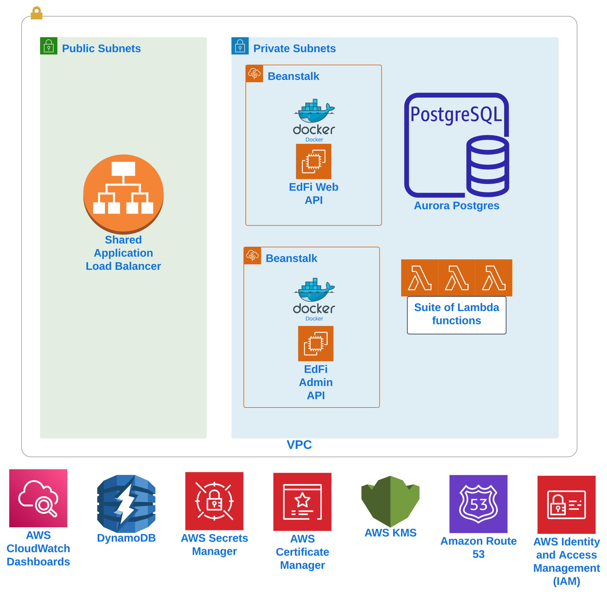

Welcome to the StartingBlocks Open Source repository! The artifacts in this repository will allow users to deploy a cloud native Ed-Fi ODS/API implementation using AWS resources. StartingBlocks is additionally inclusive of a suite of management functions that allow users to manage resources to configure their Ed-Fi deployment appropraitely for a variety of use cases.

[Deployment Steps](./docs/sbe-deployment-steps.md)

[Management and Reporting Functions Usage](./docs/sbe-functions.md)

# Overall Architecture
Below is a high level architecture diagram and inventory of <i>some</i> AWS resources deployed when using these templates. It's important to note, that once these resources are deployed, users are immediately responsible for any incurred costs, even if the environment is not being used. Please also note that there are some pre-requisite resources that are included in this diagram for informational purposes. Specifically, public subnets, VPC and private subnets must already exist prior to deploying StartingBlocks. For deployment steps [please click here](./docs/sbe-deployment-steps.md)

---

**NOTE:**

Currently we do not support deployments of the Ed-Fi Admin App for StartingBlocks v7.1. There is no Admin App currently supported by the alliance that is compatible with Ed-Fi v7.x. When there is a release of the Admin App for v7.x, we are commited to supporting it in StartingBlocks.

---

# Lambda Functions
The diagram highlights that there is a suite of AWS Lambda functions used in StartingBlocks. There are Ed-Fi environment management functions, but there are also general helper functions or functions created as custom CloudFormation resources. Below is a complete inventory of Lambda functions deployed with StartingBlocks. There is also more detail specifically on the environment management functions [in our docs folder here.](./docs/sbe-functions.md) All Lambda functions deployed by CloudFormation are prefixed by the `EnvLabel` parameter value to make them easy to find in the Lambda console.

- <b>DbRestore - </b> Restores template databases on initial StartingBlocks deployments.
- <b>EncryptionKeyGenerator - </b> CloudFormation Custom Resource provider.  Creates and stores a base64 encoded 256-bit key.
- <b>EdFiBeanstalkSNSToSlack - </b> Forwards SNS messages sent from Beanstalk Env and RDS instance to Slack.
- <b>TenantManagement - </b> Used to manage Tenants in Ed-Fi 7.x environments.
- <b>SetCloudWatchRetention - </b> CloudFormation Custom Resource provider.  Sets retention on CloudWatch Log Groups.
- <b>ODSManagement - </b> Used to manage ODSs in Ed-Fi 7.x environments.
- <b>EdOrgManagement - </b> Used to managed Education Organizations in Ed-Fi 7.x environments.
- <b>SbeMetadata - </b> Optionally Deployed if SBAA admin interface is chosen. Provides ARNs for all Lambda Ed-Fi resource management functions.
- <b>TenantResourceTree - </b> Provides tree structure of resources in a tenant.
- <b>DataFreshnessJson - </b> Provides a JSON output for resource counts and dates per table within a given ODS and Tenant.
- <b>East1Alarm - </b> Creates a Route53 Healthcheck Alarm in us-east-1.
- <b>ODSDerivatives - </b> CloudFormation Custom Resource provider. Adds/removes ODS instance derivative in admin db when ODS instance derivative is created/deleted.
- <b>ODSUserPermissions - </b> Grants permissions to users in the ODS managed by database groups.
- <b>API-Publisher-getmaxchangeversion - </b> Optionally deployed if publisher is also deployed. Lambda Function to replace the getmaxchangeversion ODS function.