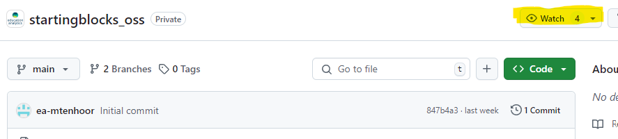

# StartingBlocks OSS Contribution Guidelines
We encourage share backs for any enhancements to the OSS repository as our main motivation in open sourcing our codebase is to foster a community for best practices and feature improvements/additions. We also welcome any community members to raise feature requests, bug fixes and general questions with regards to StartingBlocks. Our product team will prioritize and include common requests in the [greater product road map.](https://docs.startingblocks.org/).

Any feature requests or questions should be raised using [GitHub Issues on the OSS repository.](https://github.com/edanalytics/startingblocks_oss/issues) We will generally prioritize requests in the following order:

1. Community Bug Fix Pull Requests
2. StartingBlocks Product Team Bug Fix Pull Requests
3. Questions
4. Documentation Updates
5. Community Feature Addition Pull Requests
6. StartingBlocks Product Team Feature Addition Pull Requests

---

**NOTE:**
Security releases, documentation updates, and updates to the Ed-Fi application bundles will be released in special priority as deemed appropriate.

---

If you'd like to recieve up to date notifications for updates you can change your `watch` settings on the repository.
.

For most recent release please [visit the release page.](https://github.com/edanalytics/startingblocks_oss/releases/)